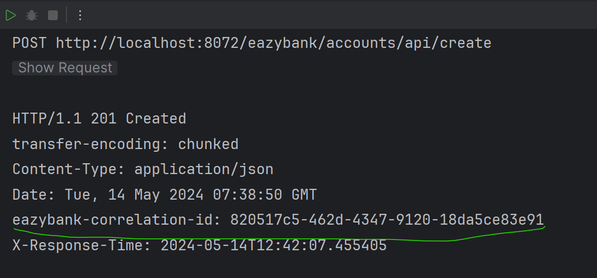
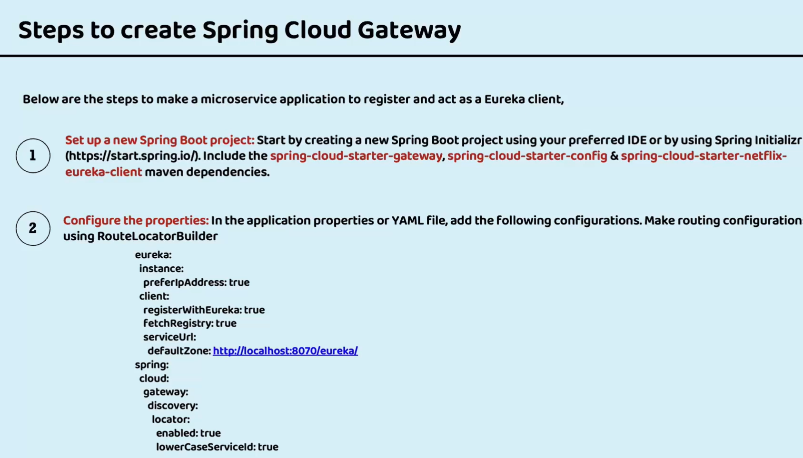
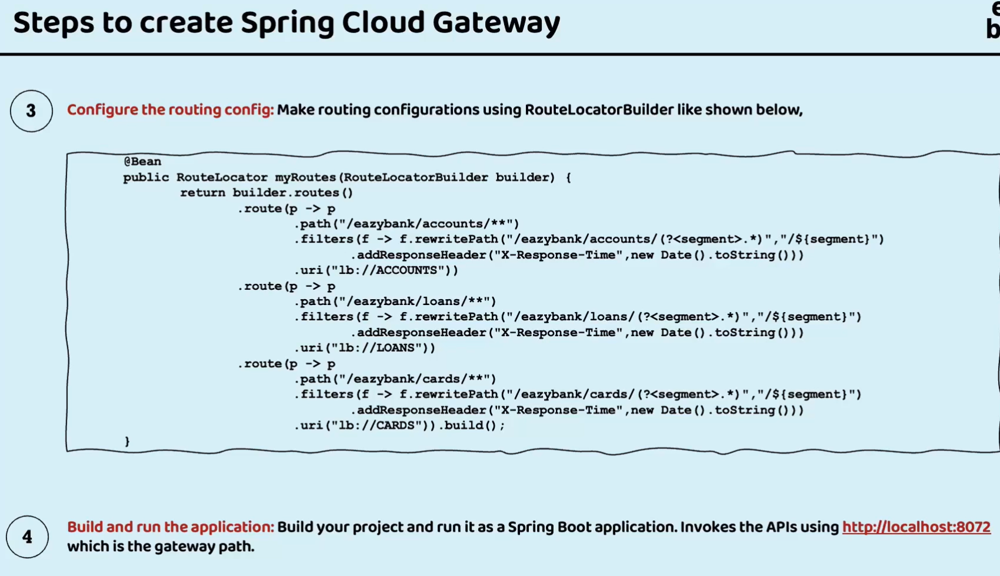

# External Traffic - API Gateway

Setting up gateway using spring api gateway
---------------------------------------
1. Add the following dependencies
    
2. Set the configuration properties - Give info about config server
    ````yaml
    spring:
      application:
        name: "gatewayserver"
      config:
        import: "optional:configserver:http://localhost:8071/"
      cloud:
        gateway:
          discovery:
            locator:
              enabled: false
              lowerCaseServiceId: true
    
    management:
      endpoints:
        web:
          exposure:
            include: "*"
      endpoint:
        gateway:
          enabled: true
      info:
        env:
          enabled: true
    
    info:
      app:
        name: "gatewayserver"
        description: "Eazy Bank Gateway Server Application"
        version: "1.0.0"
    
    logging:
      level:
        com:
          eazybytes:
            gatewayserver: DEBUG
   ````
3. Connect with eureka server -- place these config properties inside the config server
    ```yaml
           server:
           port: 8072
        
           eureka:
           instance:
           preferIpAddress: true
           client:
           registerWithEureka: true
           fetchRegistry: true
           serviceUrl:
           defaultZone: "http://localhost:8070/eureka/"
    ```
4. Start the server once all the dependent microservices are started
5. Hit `http://localhost:8072/actuator/gateway/routes `to find info about predicates and filter
    
6. Invoking the gateway instead of microservice
   Ex: `http://localhost:8072/<ServiceName>/<ApiPath> - ` 
    

Custom Routing and adding Filters - Defining custom routing paths
---------------------------------------------
1. Add the RouteLocator defining the bean
   ````java
        @SpringBootApplication
        public class GatewayserverApplication {
        
            public static void main(String[] args) {
                SpringApplication.run(GatewayserverApplication.class, args);
            }
        
            @Bean
            public RouteLocator eazyBankRouteConfig(RouteLocatorBuilder routeLocatorBuilder) {
                return routeLocatorBuilder.routes()
                                .route(p -> p
                                        .path("/eazybank/accounts/**")
                                        .filters( f -> f.rewritePath("/eazybank/accounts/(?<segment>.*)","/${segment}")
                                                .addResponseHeader("X-Response-Time", LocalDateTime.now().toString()))
                                        .uri("lb://ACCOUNTS"))
                            .route(p -> p
                                    .path("/eazybank/loans/**")
                                    .filters( f -> f.rewritePath("/eazybank/loans/(?<segment>.*)","/${segment}")
                                            .addResponseHeader("X-Response-Time", LocalDateTime.now().toString()))
                                    .uri("lb://LOANS"))
                            .route(p -> p
                                    .path("/eazybank/cards/**")
                                    .filters( f -> f.rewritePath("/eazybank/cards/(?<segment>.*)","/${segment}")
                                            .addResponseHeader("X-Response-Time", LocalDateTime.now().toString()))
                                    .uri("lb://CARDS")).build();
        
        
            }
        
        
        }
    ````
2. Examples
   
3. Response having custom header added using filter
    


Adding Custom Filters
-----------------
1. Add Custom Header - Tracer I'd for every request/response to tracer the calls from gateway server
2. Extend GlobalFilter to get hold of golbal filter add the custom filter logic then pass the control next logic
3. [Code Link](gatewayserver/src/main/java/com/eazybytes/gatewayserver/filters/RequestTraceFilter.java)
4. Update the microservices fetch apis [Code](accounts/src/main/java/com/eazybytes/accounts/controller/CustomerController.java)
5. Example Header
    

Containerizing the applications
---------------------------
1. Since gateway server is dependent on microservices health
2. Enable the health, live ness and readiness health points in every microservice
3. ```yaml

    management:
    endpoints:
    web:
    exposure:
    include: "*"
    health:
    readiness-state:
    enabled: true
    liveness-state:
    enabled: true
    endpoint:
    shutdown:
    enabled: true
    health:
    probes:
    enabled: true
    info:
    env:
    enabled: true

    ```
   
Docker Compose File
-------------------
1. Specific
2. ```yaml
    services:
    configserver:
    image: "eazybytes/configserver:s9"
    container_name: configserver-ms
    ports:
    - "8071:8071"
    healthcheck:
    test: "curl --fail --silent localhost:8071/actuator/health/readiness | grep UP || exit 1"
    interval: 10s
    timeout: 5s
    retries: 10
    start_period: 10s
    extends:
    file: common-config.yml
    service: microservice-base-config
    
    eurekaserver:
    image: "eazybytes/eurekaserver:s9"
    container_name: eurekaserver-ms
    ports:
    - "8070:8070"
    depends_on:
    configserver:
    condition: service_healthy
    healthcheck:
    test: "curl --fail --silent localhost:8070/actuator/health/readiness | grep UP || exit 1"
    interval: 10s
    timeout: 5s
    retries: 10
    start_period: 10s
    extends:
    file: common-config.yml
    service: microservice-configserver-config
    environment:
    SPRING_APPLICATION_NAME: "eurekaserver"
    
    accounts:
    image: "eazybytes/accounts:s9"
    container_name: accounts-ms
    ports:
    - "8080:8080"
    depends_on:
    configserver:
    condition: service_healthy
    eurekaserver:
    condition: service_healthy
    healthcheck:
    test: "curl --fail --silent localhost:8080/actuator/health/readiness | grep UP || exit 1"
    interval: 10s
    timeout: 5s
    retries: 10
    start_period: 10s
    environment:
    SPRING_APPLICATION_NAME: "accounts"
    extends:
    file: common-config.yml
    service: microservice-eureka-config
    
    loans:
    image: "eazybytes/loans:s9"
    container_name: loans-ms
    ports:
    - "8090:8090"
    depends_on:
    configserver:
    condition: service_healthy
    eurekaserver:
    condition: service_healthy
    healthcheck:
    test: "curl --fail --silent localhost:8090/actuator/health/readiness | grep UP || exit 1"
    interval: 10s
    timeout: 5s
    retries: 10
    start_period: 10s
    environment:
    SPRING_APPLICATION_NAME: "loans"
    extends:
    file: common-config.yml
    service: microservice-eureka-config
    
    cards:
    image: "eazybytes/cards:s9"
    container_name: cards-ms
    ports:
    - "9000:9000"
    depends_on:
    configserver:
    condition: service_healthy
    eurekaserver:
    condition: service_healthy
    healthcheck:
    test: "curl --fail --silent localhost:9000/actuator/health/readiness | grep UP || exit 1"
    interval: 10s
    timeout: 5s
    retries: 10
    start_period: 10s
    environment:
    SPRING_APPLICATION_NAME: "cards"
    extends:
    file: common-config.yml
    service: microservice-eureka-config
    
    gatewayserver:
    image: "eazybytes/gatewayserver:s9"
    container_name: gatewayserver-ms
    ports:
    - "8072:8072"
    depends_on:
    accounts:
    condition: service_healthy
    loans:
    condition: service_healthy
    cards:
    condition: service_healthy
    environment:
    SPRING_APPLICATION_NAME: "gatewayserver"
    extends:
    file: common-config.yml
    service: microservice-eureka-config
    
    networks:
    eazybank:
    driver: "bridge"
   ```
   3. Common
      ```yaml
       services:
       network-deploy-service:
       networks:
       - eazybank
    
       microservice-base-config:
       extends:
       service: network-deploy-service
       deploy:
       resources:
       limits:
       memory: 700m
    
       microservice-configserver-config:
       extends:
       service: microservice-base-config
       environment:
       SPRING_PROFILES_ACTIVE: default
       SPRING_CONFIG_IMPORT: configserver:http://configserver:8071/
    
       microservice-eureka-config:
       extends:
       service: microservice-configserver-config
       environment:
       EUREKA_CLIENT_SERVICEURL_DEFAULTZONE: http://eurekaserver:8070/eureka/
      ```

Summary
-------


    
    

