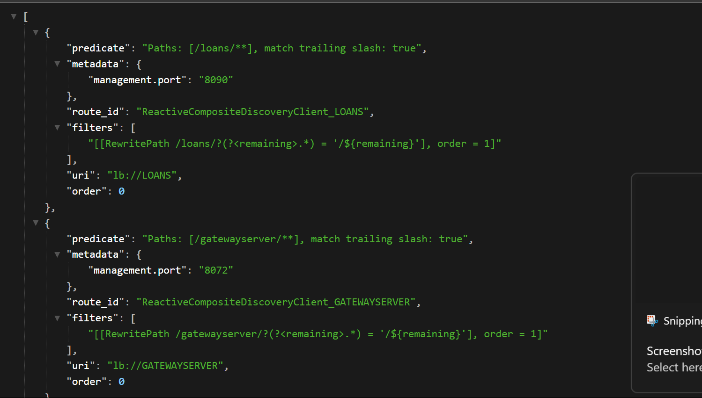

# External Traffic - API Gateway

Setting up gateway using spring api gateway
---------------------------------------
1. Add the following dependencies
    
2. Set the configuration properties - Give info about config server
    ````yaml
    spring:
      application:
        name: "gatewayserver"
      config:
        import: "optional:configserver:http://localhost:8071/"
      cloud:
        gateway:
          discovery:
            locator:
              enabled: false
              lowerCaseServiceId: true
    
    management:
      endpoints:
        web:
          exposure:
            include: "*"
      endpoint:
        gateway:
          enabled: true
      info:
        env:
          enabled: true
    
    info:
      app:
        name: "gatewayserver"
        description: "Eazy Bank Gateway Server Application"
        version: "1.0.0"
    
    logging:
      level:
        com:
          eazybytes:
            gatewayserver: DEBUG
   ````
3. Connect with eureka server -- place these config properties inside the config server
    ```yaml
           server:
           port: 8072
        
           eureka:
           instance:
           preferIpAddress: true
           client:
           registerWithEureka: true
           fetchRegistry: true
           serviceUrl:
           defaultZone: "http://localhost:8070/eureka/"
    ```
4. Start the server once all the dependent microservices are started
5. Hit `http://localhost:8072/actuator/gateway/routes `to find info about predicates and filter
    
6. Invoking the gateway instead of microservice
   Ex: `http://localhost:8072/<ServiceName>/<ApiPath> - ` 
    
7. 